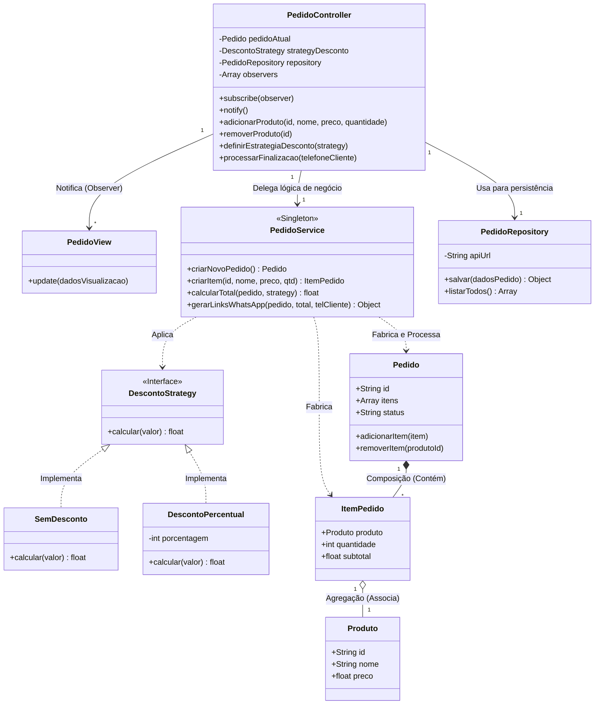

# Relatório de Análise Arquitetural - Prática Orientada 05

Este documento contém a análise crítica, a comparação estrutural e as respostas teóricas referentes à migração do sistema de pedidos para o padrão arquitetural **MVC Tradicional**.

---

## Parte 7 – Análise Arquitetural

### 1. O MVC melhorou a organização?
**Sim.** O MVC distribui o código em diretórios com papéis extremamente claros e padronizados (`models`, `views`, `controllers`). Essa separação visual e estrutural elimina o problema comum de "código espalhado", permitindo que qualquer desenvolvedor identifique imediatamente onde a interface é renderizada, onde os dados são processados e onde o fluxo é controlado.

### 2. O sistema ficou mais desacoplado?
**Sim, substancialmente.** A interface do usuário (`pedidoView.js`) não possui conhecimento sobre regras de negócio, cálculos matemáticos ou rotas HTTP; ela é apenas uma consumidora passiva de dados estruturados. Do mesmo modo, as regras de negócio e de persistência agora rodam de forma independente, sem depender de elementos específicos do DOM ou de estados globais de tela.

### 3. Onde ainda existem problemas?
O principal ponto de atenção reside no **Controller**. Por atuar como o intermediário central do ecossistema, ele precisa gerenciar as assinaturas de eventos (Observer), lidar com payloads de entrada e chamar os serviços correspondentes. À medida que novas interações visuais forem requisitadas pelo usuário, o arquivo do controlador tenderá a acumular novas funções de roteamento rapidamente.

### 4. O MVC seria suficiente para um sistema muito grande?
**Não.** Em aplicações de larga escala com dezenas de domínios, regras complexas e fluxos paralelos, o MVC tradicional centraliza regras demais em estruturas síncronas. Ele falha em fornecer isolamento por contextos de negócio (Bounded Contexts), exigindo a adoção de padrões mais robustos como *Clean Architecture*, *Hexagonal Architecture* ou divisão orientada a microserviços.

### 5. Quais limitações você percebeu?
* **Excesso de repetição de código (Boilerplate):** Para uma ação simples, o fluxo obrigatoriamente passa em cascata por View $\rightarrow$ Controller $\rightarrow$ Service $\rightarrow$ Repository, o que adiciona burocracia no desenvolvimento de recursos muito pequenos.
* **Gargalo no Controller:** O controlador absorve a responsabilidade de orquestrar todas as atualizações de estado para as views registradas.

### 6. Onde services ajudaram?
Os **Services** foram essenciais para purificar o sistema. Eles impediram o vazamento de lógica de cálculo de cupons e descontos para fora da regra de negócio (`DescontoService`) e centralizaram de forma coesa a formatação da mensagem e os parâmetros de link externo (`PedidoService`), facilitando os testes unitários.

### 7. Onde repositories ajudaram?
O **Repository** isolou completamente o mecanismo de entrada e saída (I/O). Toda a sintaxe de requisições `fetch()`, cabeçalhos HTTP e manipulação de respostas do JSON Server ficou restrita ao `PedidoRepository`. Se a infraestrutura de banco de dados mudar (de uma API REST para um banco SQL local como SQLite), nenhuma outra camada do software precisará ser modificada.

---

## Parte 8 – Problemas do MVC Tradicional em Larga Escala

Caso este sistema continuasse crescendo e incorporando módulos como controle de estoque, fluxo de entregas, faturamento e gestão de múltiplos estabelecimentos, o MVC tradicional manifestaria sérios problemas estruturais:

* **Controllers Gordos (Fat Controllers):** Sem uma divisão focada em casos de uso específicos, os controladores acumulam fluxos de múltiplas origens, tornando-se arquivos gigantescos com centenas de linhas difíceis de ler e testar.
* **Excesso de Responsabilidades:** O controlador passa a acumular validações de formato, tratamento de exceções de rede e orquestração de múltiplos estados visuais ao mesmo tempo.
* **Dificuldade de Manutenção:** O risco de introduzir efeitos colaterais aumenta. Alterar o fluxo de uma rota dentro do controlador pode quebrar inesperadamente o disparo de notificações de outra View que compartilha o mesmo canal.
* **Dificuldade de Navegação:** A organização puramente técnica do MVC (juntar todos os controladores em uma pasta e todos os modelos em outra) faz com que o desenvolvedor precise abrir arquivos de extremos opostos do projeto para dar manutenção em uma única funcionalidade (como "Adicionar Desconto").
* **Aumento do Acoplamento:** As entidades de modelo começam a se interligar de forma complexa e o controlador passa a depender de múltiplos serviços simultaneamente para responder a uma única requisição.
* **Dificuldade de Escalabilidade:** Fica inviável separar partes do sistema para serem desenvolvidas por equipes diferentes ou distribuídas de forma isolada em servidores independentes (microserviços).

---

## Parte 9 – Comparação Arquitetural

| Critério | Sistema Original | MVC Refatorado |
| :--- | :--- | :--- |
| **Organização** | Inexistente/Código Espalhado | Excelente (Pastas com responsabilidades técnicas definidas) |
| **Coesão** | Baixa (Funções acumulavam múltiplos papéis) | Alta (Cada classe executa estritamente uma função) |
| **Acoplamento** | Crítico (Regras misturadas a seletores do DOM) | Baixo (Comunicação baseada em contratos e eventos) |
| **Reutilização** | Nula / Código Duplicado | Elevada (Services e Repositories isolados e portáveis) |
| **Clareza estrutural** | Confusa / Difícil leitura | Transparente e Previsível |
| **Escalabilidade** | Inviável | Viável para médio porte (Gargalo em larga escala) |
| **Facilidade de manutenção** | Complexa (Efeitos colaterais constantes) | Facilitada pelo isolamento claro de bugs |

---

## Parte 10 – Modelagem

### Diagrama de Classes Abstrato

---

### Fluxo MVC Unidirecional

O ciclo de vida de uma requisição ou ação do usuário dentro do ecossistema segue rigorosamente a sequência descrita abaixo:

[ Usuário interage ]
│
▼

VIEWS (Captura o evento do clique/entrada do usuário)
│
▼

CONTROLLERS (Recebe o evento da View, valida o fluxo e aciona o motor lógico)
│
▼

SERVICES (Processa os cálculos matemáticos, descontos e formatações de negócio)
│
▼

REPOSITORIES (Recebe o payload estruturado e persiste os dados via HTTP no servidor)
│
▼

MODELS (Representam a integridade e o estado dos dados em memória em todo o fluxo)